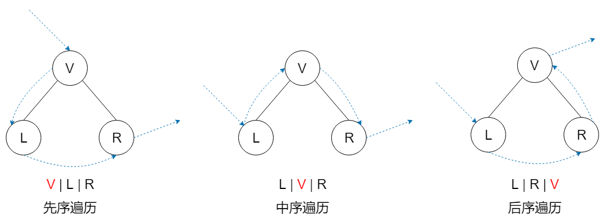
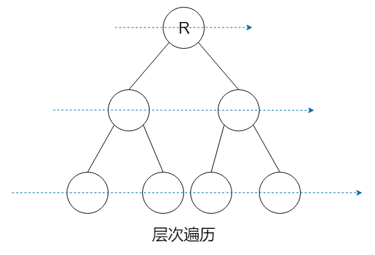
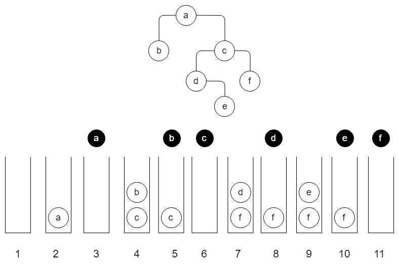

# 概述

二叉树的遍历是一个很常见的问题。二叉树的遍历方式主要有：先序遍历、中序遍历、后序遍历、层次遍历。先序、中序、后序其实指的是父节点被访问的次序。若在遍历过程中，父节点先于它的子节点被访问，就是先序遍历；父节点被访问的次序位于左右孩子节点之间，就是中序遍历；访问完左右孩子节点之后再访问父节点，就是后序遍历。不论是先序遍历、中序遍历还是后序遍历，左右孩子节点的相对访问次序是不变的，总是先访问左孩子节点，再访问右孩子节点。而层次遍历，就是按照从上到下、从左向右的顺序访问二叉树的每个节点。





在介绍遍历算法之前，先定义一个二叉树的结构体。使用的是 C++ 语言。

```cpp
//filename: BinTreeNode.h
template <typename T> struct BinTreeNode {
    T data; //数据域
    BinTreeNode * LeftChild; //左孩子指针
    BinTreeNode * RightChild; //右孩子指针
};
```

# 先序遍历

## 递归

使用递归，很容易写出一个遍历算法。代码如下：

```cpp
//filename: BinTreeNode.h
template <typename T>
void travPre_R(BinTreeNode<T> * root) {
	if (!root) return;
	cout << root->data;
	travPre_R(root->LeftChild);
	travPre_R(root->RightChild);
}
```

## 迭代

在之前的文章中，我不止一次地说过，递归是很耗费计算机资源的，所以我们在写程序的时候要尽量避免使用递归。幸运的是，绝大部分递归的代码都有相应的迭代版本。那么我们就试着将上述递归代码改写成迭代的版本。改写之后，代码如下：

```cpp
//filename: BinTreeNode.h
template <typename T>
void travPre_I1(BinTreeNode<T> * root) {
	Stack<BinTreeNode<T>*> s; //辅助栈
	if (root) //如果根节点不为空
		s.push(root); //则令根节点入栈
	while (!s.empty()) { //在栈变空之前反复循环
		root = s.pop(); cout << root->data; //弹出并访问当前节点
        
        //下面左右孩子的顺序不能颠倒，必须先让右孩子先入栈，再让左孩子入栈。
		if (root->RightChild)
			s.push(root->RightChild); //右孩子先入后出
		if (root->LeftChild)
			s.push(root->LeftChild); //左孩子后入先出
	}
}
```

下面我们通过一个实例来了解一下该迭代版本是如何工作的。



PS：黑色的元素表示已经被弹出并访问过。

结合代码，该二叉树的先序遍历过程如下：

1. 初始化一个空栈。
2. 根节点入栈，此时将 a 入栈。
3. 循环开始，弹出并访问栈顶元素，此时栈顶元素是 a。
4. 如果 a 有右孩子，则将其右孩子节点入栈；如果 a 有左孩子，则将其左孩子节点入栈。此时栈中有 b、c 两个元素。
5. 这时进入下一轮循环。弹出并访问栈顶元素，此时栈顶元素是 b。经检查，b 没有右孩子，也没有左孩子，进入下一轮循环。
6. 弹出并访问栈顶元素，此时栈顶元素是 c。c 的右孩子是 f，左孩子是 d，故分别将 d、f 入栈。进入下一轮循环。
7. 此时栈中的元素是 d、f。
8. 弹出并访问栈顶元素，此时栈顶元素是 d。d 的右孩子是 e，d 没有左孩子，故将 e 入栈。进入下一轮循环。
9. 此时栈中的元素是 e、f。
10. 弹出并访问栈顶元素，此时栈顶元素是 e。e 没有左右孩子，进入下一轮循环。
11. 弹出并访问栈顶元素，此时栈顶元素是 f。f 没有左右孩子，进入下一轮循环。
12. 此时栈为空，退出循环。遍历结束。

这个迭代的遍历算法非常简明，但是很遗憾，这种算法并不容易推广到我们接下来要研究的中序遍历和后序遍历。因此我问需要寻找另一种策略。